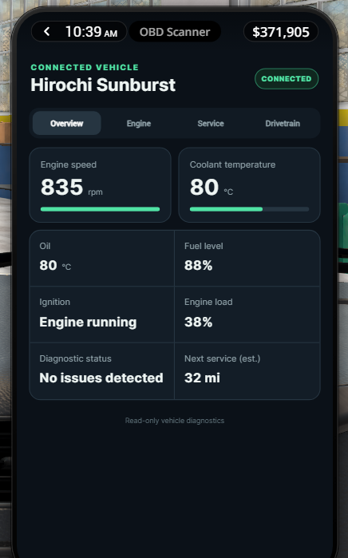
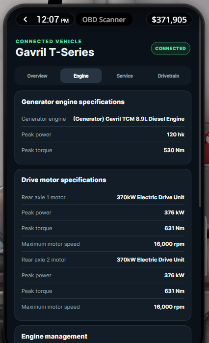

# RLS OBD Scanner

RLS OBD Scanner is a standalone phone app for the BeamNG.drive RLS Career
Overhaul. It presents live vehicle diagnostics and maintenance information in a
compact scan-tool interface.

<table>
  <tr>
    <td></td>
    <td></td>
  </tr>
</table>

The app can display available information for:

- Combustion engines, electric vehicles, and series hybrids
- Engine and drive-motor specifications
- Battery charge, fuel level, temperatures, RPM, and propulsion load
- Transmissions, clutches, differentials, and electric drive units
- RLS service condition and maintenance findings
- Active faults and recently observed diagnostic events

All information is read directly from BeamNG and RLS. Unsupported values are
hidden rather than estimated, and the scanner does not modify vehicle condition
or maintenance data.

## Requirements

- BeamNG.drive
- RLS Career Overhaul

The scanner is designed for the RLS career phone and is not intended to replace
BeamNG's standard vehicle apps outside career mode.

## Maintenance Mode

The scanner works whether RLS Maintenance Mode is enabled or disabled for the
current career save. When enabled, the Service tab and maintenance-derived
findings use RLS vehicle condition data. When disabled, those values are
suppressed while native BeamNG readings and supported diagnostic events remain
available.

The scanner reads RLS's actual per-save Maintenance Mode state and does not
initialize, repair, or otherwise modify maintenance data.

## Current limitations

- Parallel, series-parallel, and mild-hybrid layouts have not yet been validated
  and may expose their powertrains differently.
- Unsupported or vehicle-specific damage states are hidden rather than assigned
  guessed scan-tool descriptions.

## Installation

Download the release archive and place it in your BeamNG.drive `mods` folder.
Start an RLS career, open the phone app store, and install **OBD Scanner**.

Background monitoring is enabled only for career saves where the phone app is
installed.

## Vehicle support

Support has been validated with conventional combustion vehicles, pure-electric
vehicles, dual-motor EVs, and diesel-electric series hybrids. Other hybrid
layouts may expose their powertrains differently and are not yet fully tested.

## Unofficial project

This is an unofficial community project for RLS Career Overhaul. It is not
affiliated with or endorsed by the RLS team. If the RLS team would prefer this
repository to be renamed, made private, or removed, please contact me and I will
address it.

Development of this project is AI-assisted. Changes are reviewed and validated
against live BeamNG vehicle data before release.
